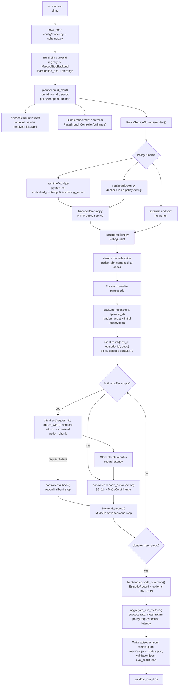

# Inference Pipeline Lifecycle

This note maps the current M1 implementation: a host-stepped MuJoCo rollout that
talks to an isolated blank policy service over HTTP. It is intentionally narrower
than the broader v2.3 design document.

## Folder Ownership

| Folder | Handles | Key files |
| --- | --- | --- |
| `config/` | User job schema, resolved artifact schemas, YAML loading | `schemas.py`, `loader.py` |
| `orchestration/` | End-to-end lifecycle: plan, launch policy runtime, run rollout, collect artifacts | `runner.py`, `planner.py`, `supervisor.py`, `registry.py` |
| `runtime/` | Concrete policy service launch mechanisms | `local.py`, `docker.py`, `ports.py` |
| `transport/` | Policy service wire contract and HTTP client/server | `protocol.py`, `client.py`, `server.py`, `factory.py` |
| `policies/` | Debug policy service and blank zero/random policies | `base.py`, `debug_server.py` |
| `sim/` | Host-stepped simulator backend and wire-safe observations | `base.py`, `mujoco_backend.py`, `models.py` |
| `embodiments/` | Lower-level action adapter: normalized policy command to simulator control | `base.py`, `passthrough.py` |
| `artifacts/` | Normalized run directory writes and validation | `store.py`, `validation.py` |
| `metrics/` | Aggregate metrics from episode records | `aggregate.py` |
| `logging/` | Structured logger utilities and timestamp helper | `logger.py`, `config.py`, `timeutil.py` |
| `containers/` | Minimal policy service image | `policy_debug/Dockerfile` |
| `examples/` | Runnable job YAMLs for local and Docker policy runtimes | `mujoco_*.yaml` |
| `runs/` | Generated run outputs | `runs/<run_id>/...` |

## Lifecycle Diagram



## Runtime Sequence

1. `ec eval run` calls `load_job()`, which validates the YAML into an `EvalJob`.
2. `run_eval()` constructs the sim backend first so it can discover the simulator
   `action_dim` and actuator `ctrlrange`.
3. `planner.build_plan()` resolves the run id, run directory, per-episode seeds,
   policy endpoint, and policy runtime.
4. `ArtifactStore` creates the run directory and persists both the original job
   and immutable resolved execution plan before runtime launch.
5. `PolicyServiceSupervisor` either attaches to an external endpoint, starts a
   local subprocess, or starts a Docker container.
6. The supervisor returns a `PolicyClient` after `/health` is ready.
7. `run_eval()` calls `/describe` and verifies policy `action_dim` equals the sim
   backend `action_dim`.
8. The rollout loop resets simulator state, then resets the policy episode key.
9. During rollout, the host requests an action chunk only when its local action
   buffer is empty.
10. The embodiment controller maps each normalized action to simulator controls.
11. The backend steps MuJoCo and emits the next wire-safe observation.
12. At episode end, the backend summary becomes an `EpisodeRecord` plus optional
   raw JSON.
13. After all episodes, metrics are aggregated and the normalized artifact set is
   written.
14. `validate_run_dir()` checks required artifacts and schemas.

## Current Verification Status

The light default test suite passes:

```text
pixi run test
16 passed, 1 skipped
```

The sim suite currently fails at import time:

```text
pixi run -e sim test-sim
ModuleNotFoundError: No module named 'embodied_control.telemetry'
```

`runner.py` imports `embodied_control.telemetry.events.EventLog` and
`utcnow_iso`, but the repository currently has `logging/` utilities and no
`telemetry/` package. The intended event/logging role appears to be either:

- restore `src/embodied_control/telemetry/events.py`, or
- update `runner.py` to construct/use `embodied_control.logging.EcLogger` and
  `embodied_control.logging.timeutil.utcnow_iso` directly.
